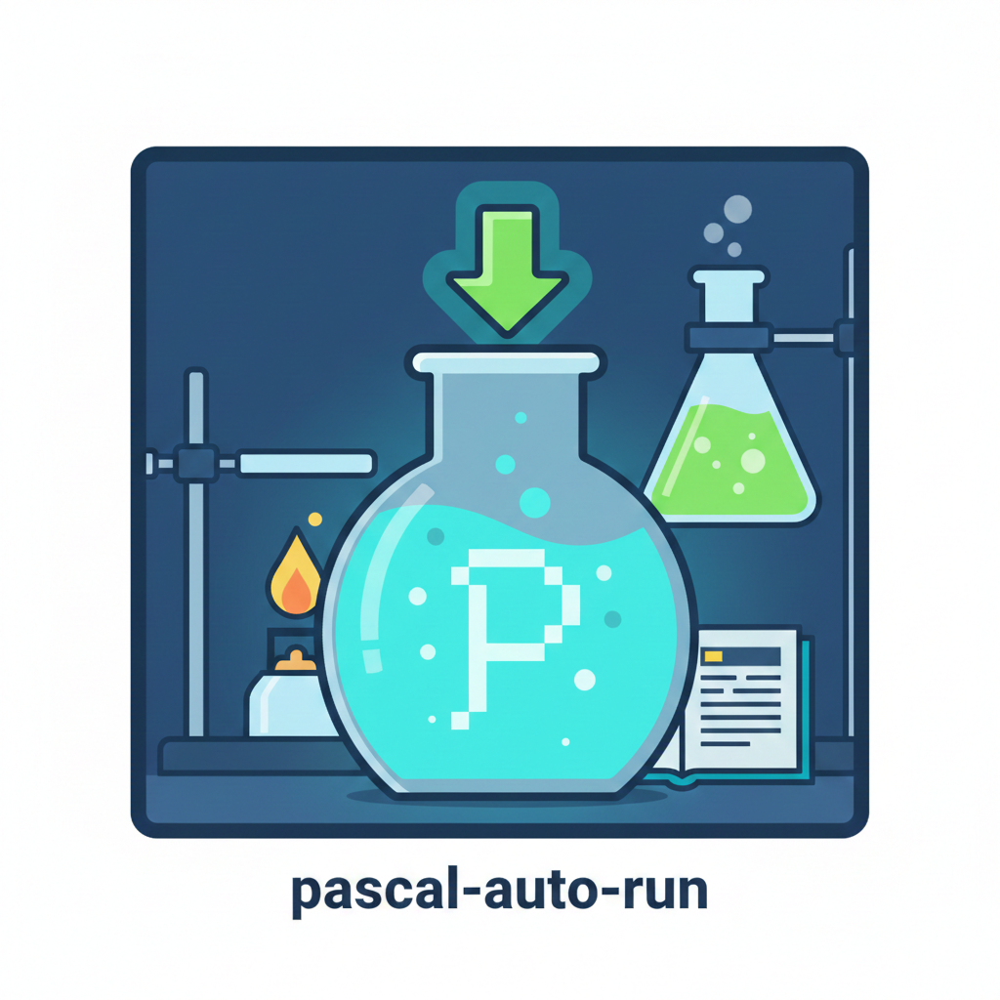

# Pascal Auto Run

<p align="center">
  
</p>

<p align="center">
  <strong>Compile and run your Pascal programs with one click directly in VS Code.</strong>
</p>

<p align="center">
  <a href="#english">English</a> | <a href="#français">Français</a>
</p>

---

## English

### Quick Start

1. Install [Free Pascal Compiler](https://www.freepascal.org/download.html)
2. Open a `.pas` file in VS Code
3. Click the beaker icon (🧪) in the top-right corner

That's it!

### Features

- One-click compile and run
- Auto-detects `fpc` compiler
- Works on Windows, macOS, and Linux
- Supports `.pas`, `.pp`, `.inc`, `.lpr` files

### Setup

If the compiler isn't found automatically:

1. Press `Ctrl+Shift+P` (or `Cmd+Shift+P` on Mac)
2. Type "Pascal: Select Compiler Path"
3. Select your `fpc.exe` file

### Settings

Open VS Code settings and search for "Pascal Auto Run":

- **Compiler Path** - Leave empty for auto-detection
- **Compiler Options** - Add flags like `-O3` if needed
- **Save Before Compile** - Default: enabled
- **Pause After Execution** - Default: enabled
- **Cleanup After Compile** - Delete `.o` and `.ppu` files (default: disabled)

### Example

```pascal
program Hello;
begin
  WriteLn('Hello, Pascal!');
  ReadLn;
end.
```

### Support

Found a bug? [Open an issue](https://github.com/Vianology/pascal-auto-run/issues)

---

## Français

### Démarrage rapide

1. Installez [Free Pascal Compiler](https://www.freepascal.org/download.html)
2. Ouvrez un fichier `.pas` dans VS Code
3. Cliquez sur l'icône bécher (🧪) en haut à droite

C'est tout !

### Fonctionnalités

- Compilation et exécution en un clic
- Détecte automatiquement le compilateur `fpc`
- Fonctionne sur Windows, macOS et Linux
- Supporte les fichiers `.pas`, `.pp`, `.inc`, `.lpr`

### Configuration

Si le compilateur n'est pas trouvé automatiquement :

1. Appuyez sur `Ctrl+Shift+P` (ou `Cmd+Shift+P` sur Mac)
2. Tapez "Pascal: Select Compiler Path"
3. Sélectionnez votre fichier `fpc.exe`

### Paramètres

Ouvrez les paramètres VS Code et recherchez "Pascal Auto Run" :

- **Chemin du compilateur** - Laisser vide pour détection automatique
- **Options du compilateur** - Ajoutez des options comme `-O3` si nécessaire
- **Sauvegarder avant compilation** - Par défaut : activé
- **Pause après exécution** - Par défaut : activé
- **Nettoyage après compilation** - Supprime les fichiers `.o` et `.ppu` (par défaut : désactivé)

### Exemple

```pascal
program Bonjour;
begin
  WriteLn('Bonjour, Pascal !');
  ReadLn;
end.
```

### Support

Un bug ? [Ouvrez une issue](https://github.com/Vianology/pascal-auto-run/issues)

---

## Author

**AGBENONWOSSI Kokou Kplolali (Vianology)**  
GitHub: [@Vianology](https://github.com/Vianology)

---

## License

MIT License